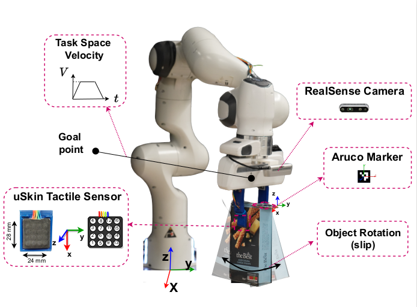

# slip-cont-traj-adapt

This repository includes the codes and sample dataset to run the experiments for Reactive Slip Control (**RSC**) and Proactive Slip Control (**PSC**) by robot trajectory adaptation.

There are two stages to run the experiments:
* offline training of slip classification (detection/prediction) models
* online slip control by trajectory adaptation

**Offline Training**

We collected a dataset of pick-and-move tasks by sending a reference trajectory for robot's task space velocity. The Panda Franka robot executes a linear motion in XY plane in the base frame. A box shaped object is used as the training object and two uSkin tactile sensors from XELA ROBOTICS are attached to the 3d printed fingers mounted on franka gripper. A wrist camera reads the pose of an Aruco marker attached on the objects to detect objec's relative motion w.r.t the EE and generating the binary slip ground truth values. The data set include synchronized tactile (2 x $D \in R^{48}$), robot ($q \in R^7$, $dq \in R^7$, $EE_{pose} \in R^{16}$, and $EE_{vel} \in R^6$), and marker pose data ($P \in R^7$).

  
      
  
Figure1. Experimental Setup

The *gen_dataset.py* in both /slip_detection and /slip_preditction directories should be run first to preprocess and save sequences of data in a specified directory. Since we don't want to load all of the dataset into memory when training, we save them as sequences and load them in batches by using the *map.csv* (file which contains all file names) and torch data_loader class.

        run gen_dataset.py to create data sequences for training.

After this stage, we can run the *model_train.py* script in each directory to train and save the slip detection and slip prediction models.

        run model_train.py to train slip classification models.

Now that we have the (i) trained torch models and (ii) saved scalars for preprocessing, we can go to the real time test stage.

**Online slip control**

Edit the data set and output folder directories in the script. We use two slip classification models. One is a slip detection model which uses a history of tactile data to predicit the slip binary state at current time step. The second model is an action-conditioned modek which use tatctile hisory alongside future robot trajectory for slip prediction. The training scripts for these models are in /slip_detection and \AC_slip_prediction directories respectively. 
